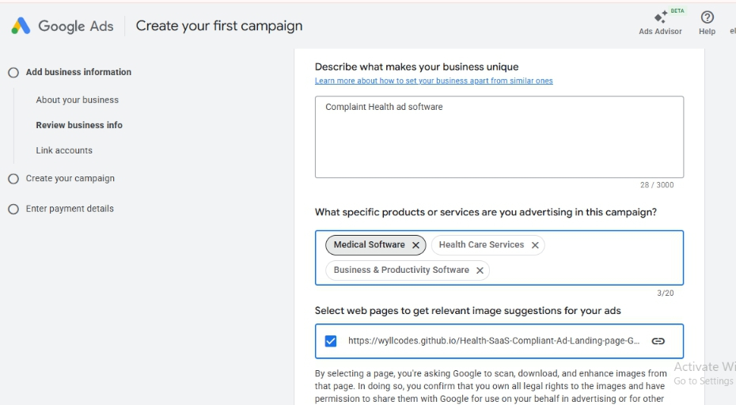
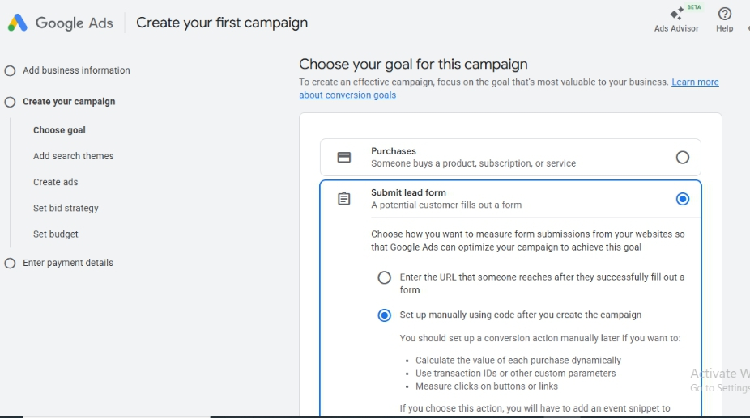
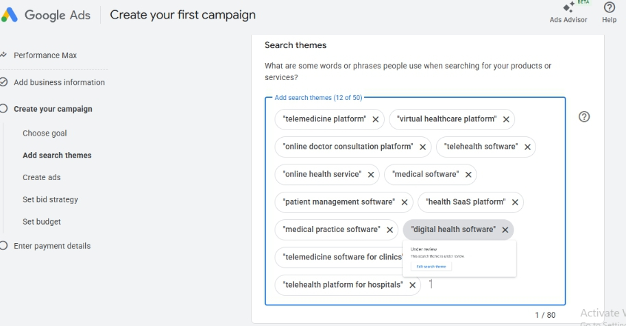
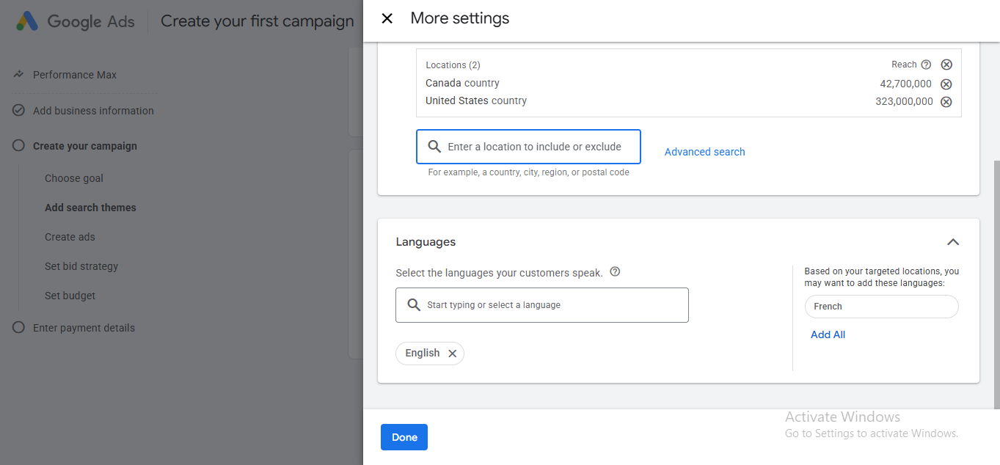
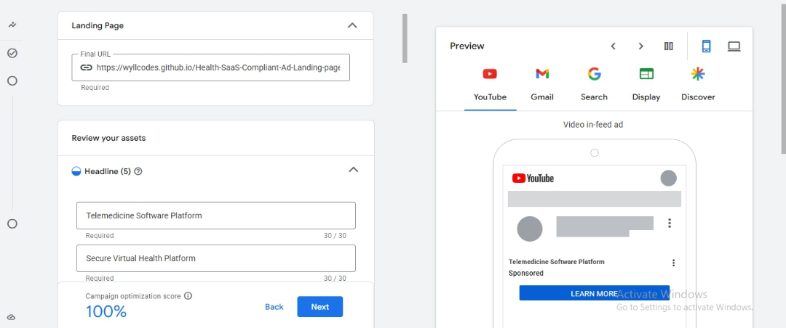
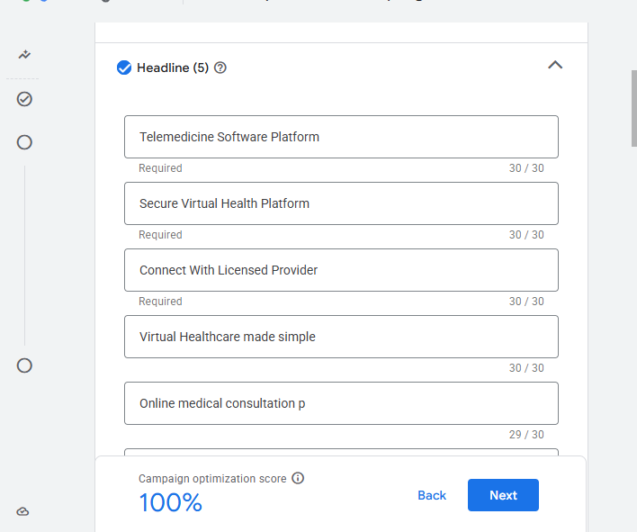
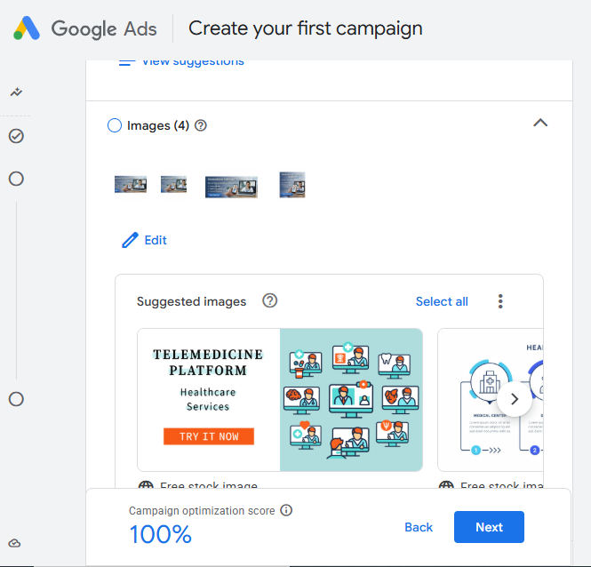
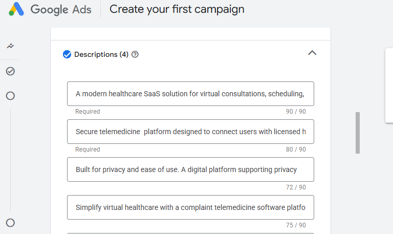
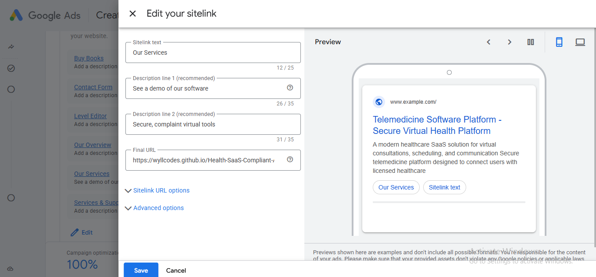
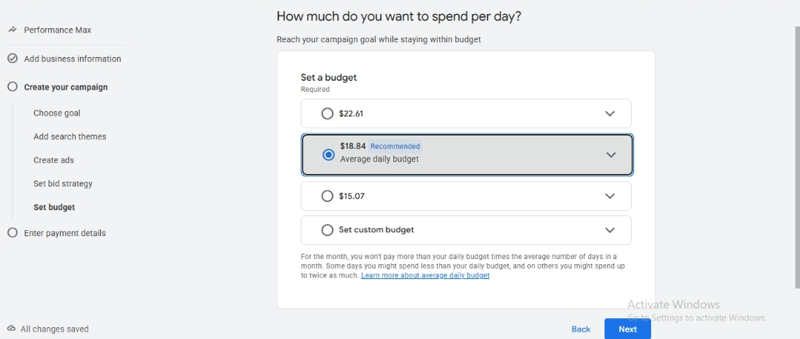

# Telemedicine Google Ads + Landing Page (Compliance-First Case Study)
How I Built a Google-Compliant Telemedicine Ads System That Converts Without Policy Violations, Scaling Telemedicine with Google Search Ads – Without Account Suspension
It also includes a high-converting telemedicine  landing page hosted on GitHub Pages.

## Problem – Solution – Outcome
The Problem:
Health Startups struggle with:
-	Google Ads disapprovals
-	Healthcare policy restrictions
-	Low-trust Landing Pages
-	Fear of account suspension
Many telemedicine Ads fail before they scale.

### The Solution
I Built:
-	A Google-policy-complaint search ad campaign
-	A trust-optimized telemedicine landing page
-	A documentation system for audit & scale
### The Outcome (Simulated)
This is a portfolio case study: 
Results(Simulated/ Test Campaign):
-	Ads approved on first review
-	Zero policy violations
-	High-intent healthcare keywords
-	Conversion-focused landing experience

##  Live Demo
-	**Landing Page: ** https://wyllcodes.github.io/Telemedicine-Google-Ads-Case-Study/
-	**Ad Type:** Google Search (Healthcare / Telemedicine)

##  Project Objective
-	Build a Google-complaint healthcare search ad
-	Avoid restricted medical claims
-	Drive traffic to a clear, compliant telemedicine landing page
-	Document the entire process for portfolio and client demonstration
## Telemedicine Landing Page

### Key Features:
-	Clear Value Proposition
-	No Medical guarantees
-	HIPAA / PHIPA compliant messaging
-	CTA focused on *booking a consultaion*
  
### Screenshots:
! [mobile view] (     )

## Google Search Ads Setup (Step-by-Step)

### 1 Add Business Information

**Examples:**
-	Describe what makes your business Unique
-	What specific services or products are you advertising in this campaign?
-	Select Pages to get relevant image Ad suggestions
  
### 2 Choose Your Goal for this Campaign

**Campaign Goal Used**
-	Submit Lead Form (potential customer fills and submits a form)

### 3 Search Themes Setup

**Search Themes Used:**
-	Telemedicine services
-	Online healthcare consultation
-	Medical software

### 4 Location & Langauges

**Target Demographics Used**
-	Canada (English & French)
-	USA (English)

### 5 Writing Google Complaint Ad Headlines

**Headline Examples:**
-	Telemedicine Software Platform
-	Secure Virtual Health Platform
-	Connect with a licensed Provider

### 6 Ad  Descriptions ( Policy Safe)

**Description Examples:**
-	A modern healthcare SaaS solution for virtual consultation, scheduling
-	Built for privacy & ease of use. A digital platform supporting privacy

### 7 Ad Asset(images)

### 8 Healthcare Policy Review

**Compliance Steps Taken:**
-	No diagnosis claims
-	No guaranteed outcomes
-	No restricted medical conditions
-	Clear disclaimer added on Landing Page

### 9 Final Ad  Preview

-	Desktop Preview
-	Mobile Preview

### 10 Bid Strategy

### 11 Set Budget

### 12 Enter Payment Details

## Google Ads Healthcare Compliance Notes
Key rules followed:
-	No “cure”, “treat”, or “guarantee” Language
-	No personal medical claims
-	Clear business identity
-	Transparent service  explanation
## Tools Used
-	Google Ads (Search Campaign)
-	HTML + CSS (Landing Page)
-	GitHub Pages (Hosting)
-	Google Keyword Planner
## Use Case
This Project can be used as:
-	Health SaaS Ad Demonstration

## Who is this for
Ideal For:
-	Telemedicine startups
-	Digital clinics
-	Health SaaS founders
-	Medical appointment platforms
-	Wellness Startups
  
Not Ideal for:
-	Miracle cure products
-	Unverified supplements
-	Aggressive medical claims

## Contact
Want this implemented for your Health startup or SaaS?

I help Health & Telemedicine  companies:
-	Launch Google-approved Ad Campaigns
-	Avoid account suspension 
-	Convert high-intent healthcare traffic
  
Let’s talk
**Email:** elegodswyll@gmail.com

**Linkedln:** https://www.linkedin.com/in/ele-godswill-b84904376?

# Core Value Proposition:
 KuboMed helps healthcare organizations & Patients streamline operations, manage records, and improve workflow efficiency - without providing medical diagnosis or treatment.
